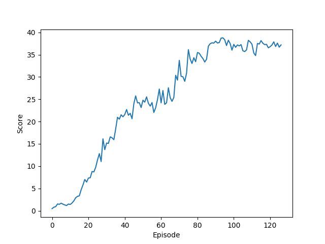

# Report

This report presents the approach taken to solve the second project of Udacity's Deep Reinforcement Learning Nanodegree Program, where the goal is to train an agent to move a double-jointed robot hand to a goal location and keep it there. The agent receives a reward of +0.1 for each step that the agent's hand is in the goal location. Thus, the goal of the agent is to maintain its position at the goal location for as many time steps as possible. This project addresses an environment where 20 identical agents are trained simultaneously. Furthermore, this report also shows some results and directions for future work.

## Solution

The agents perform Deep Deterministic Policy Gradient Learning in the environment. Addressing the problem as an episodic task, the agents train for a given number of episodes or until they solve the environment. The environment is solved when the agents receive an average reward of +30 over the last 100 episodes.

### Agent hyperparameters

The agents use the following hyperparameters:
- **`BATCH_SIZE`** (128): size of the mini-batches;
- **`BUFFER_SIZE`** (1e5): size of the replay buffer;
- **`GAMMA`** (0.99): discount factor;
- **`LR_ACTOR`** (1e-4): learning rate of the Adam optimizer for the actor;
- **`LR_CRITIC`** (1e-3): learning rate of the Adam optimizer for the critic;
- **`TAU`** (1e-3): interpolation factor for the soft update of the target network;
- **`WEIGHT_DECAY`** (0): L2 weight decay for the Adam optimizer for the critic.

### Neural network architectures

The **`Actor`** maps each state of the environment to an action, which is a vector of four numbers between -1 and +1. The network consists of three fully-connected linear layers with ReLU activation functions. The output layer uses the `tanh` activation function to produce values between -1 and +1 for each of the four outputs. The first hidden layer consists of 400 units, whereas the second hidden layer consists of 300 units.

The **`Critic`** maps a state and action to a Q-value, which reflects the estimated quality of the given action in the given state. The network consists of three fully-connected linear layers with ReLU activation functions. The output layer produces the estimated value of the given action in the given state. The first hidden layer consists of 400 units, whereas the second hidden layer consists of 300 units.

## Results



```
Episode 25	Average score: 3.72
Episode 50	Average score: 11.38
Episode 75	Average score: 16.38
Episode 100	Average score: 21.34
Episode 125	Average score: 29.66
Episode 127	Average score: 30.16

Environment solved in 127 episodes!	Average score: 30.16
```

The 20 agents solved the environment in 127 episodes obtaining an average reward of +30.16 over the last 100 episodes.

## Future work

The following future work directions are worth exploring:
* **Optimize hyperparameters:** optimize the parameters using Bayesian optimization;
* **Optimize network architectures:** try different numbers of units for the hidden layers;
* **Perform Distributed Distributional Deterministic Policy Gradient (D4PG) Learning:** replace the Deep Deterministic Policy Gradient Learning algorithm by the Distributed Distributional Deterministic Policy Gradient Learning (D4PG) algorithm ([paper](https://openreview.net/pdf?id=SyZipzbCb)).